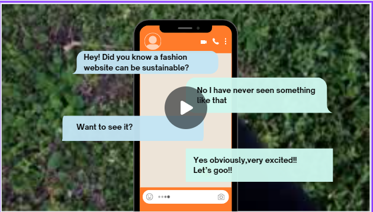

# EcoChic

Welcome to **EcoChic**, your go-to platform for sustainable fashion innovation! Our website offers unique features to engage users in creative, eco-friendly fashion activities.

## Key Features

1. **Design Challenges**: Host design challenges where users can submit their creative fashion designs. Top designs are rewarded with free coupons, and winning designs are produced by the fashion industry.

2. **Virtual Reality Fashion Show**: Showcase fashion designs in virtual reality environments, allowing users to view and interact with fashion shows.

3. **AI-Generated Trendy Designs**: Use AI-driven design tools to generate trendy designs based on user creativity, fostering engagement and innovation.

4. **Upcycling Tutorials**: Offer tutorials on upcycling old clothes into new fashion items through integrated videos and articles.

5. **Promote Sustainability**: Encourage users to donate their old clothes for thrifting. In return, they can earn points and coupons. These donated clothes will be sold with sustainability labels that provide detailed information about their reuse, promoting a circular economy and environmental responsibility.

6. **Chatbot Assistance**: Provide users with a chatbot to answer questions about the website and its features.

## Tech Stack

- **Frontend**: HTML, CSS, JavaScript
- **Backend**: Firebase Authentication, Firestore Database, Firebase Storage
- **VR Experience**: A-Frame, Three.js
- **APIs and Tools**: ImgGen API, YouTube API, Chatbase API

## Prototype and Database Structure
Explore the prototype snippets by visiting the following link: [Prototype](https://github.com/sriya-singh/EcoChic/tree/main/Prototype)
Explore the database structure by visiting the following link: [Database](https://github.com/sriya-singh/EcoChic/tree/main/Database%20Structure)

## Demo Video
Watch our demo video to get a better idea of our website:

## Live Website
To experience EcoChic live, visit our website:
[EcoChic Live](https://sriya-singh.github.io/EcoChic/weforshe/)

---

Thank you for visiting EcoChic! Together, let's make fashion sustainable and innovative! 🌿👗
