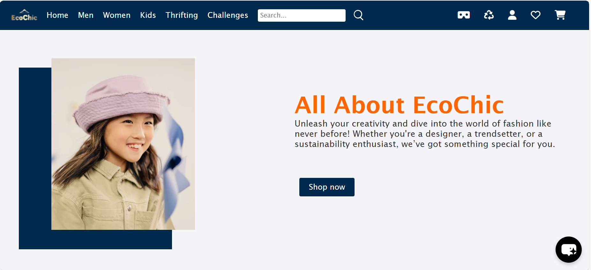
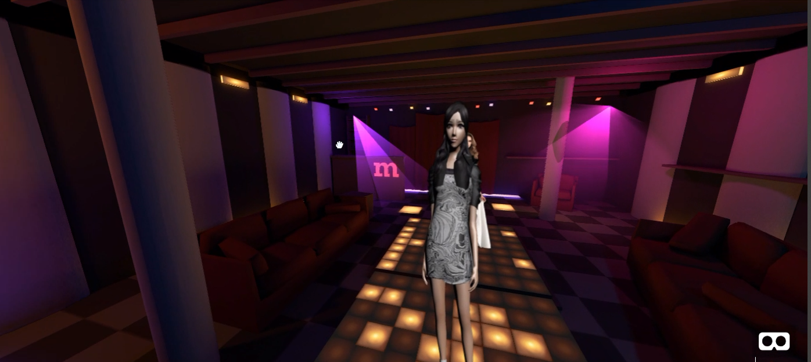

# EcoChic

### Solution for Website

**Feature: Design Challenges**  
Host design challenges where users can submit their creative fashion designs. Top designs are rewarded with free coupons and winning designs are produced by the fashion industry.

**Feature: Virtual Reality Fashion Show**  
Showcase fashion designs in virtual reality environments, allowing users to view and interact with fashion shows.

**Feature: AI-Generated Trendy Designs**  
Use an AI bot to generate trendy designs based on user creativity, fostering engagement and innovation.

**Feature: Upcycling Tutorials**  
Offer tutorials on upcycling old clothes into new fashion items through integrated videos and articles.

**Feature: Promote Sustainability**  
Enable users to donate old clothes, earn points and coupons, and receive sustainability labels with detailed reuse information.

**Design Challenges**:
**Feature**: Design Challenges

**Functionality**: Host design challenges for users to submit their creative fashion designs. This includes a special summer design challenge on the website.

**Implementation:**
A submission portal where users can upload their designs.
Users can generate designs using an AI tool provided in the challenge section.
Designs with the most votes will be rewarded with free coupons.
Winning designs will be produced by the fashion industry.

**Tech Stack:**
Frontend: HTML, CSS, JavaScript
AI: AI image generation API
Backend: Firebas

**Virtual Runaway Shows**

**Feature:** Virtual Reality Fashion Show
**Functionality:** Showcase fashion designs in virtual reality environments.
**Implementation:** Developed VR experiences where users can view and interact with fashion shows.
**Tech Stack:** A-Frame(HTML), Three.js (3D graphics), CSS, JS,HTML

**AI Design Lab**

**Feature:** AI-Generated Trendy Designs
**Functionality:** Use an AI bot to generate trendy designs based on user creativity.
**Implementation:** Allow users to create and submit designs using the AI tool, fostering engagement and creativity.
**Tech Stack:** 
Frontend: HTML, CSS, JavaScript
AI : AI image generation API
Backend: Firebase

**Upcycling Ideas and DIY Tutorials**

**Functionality:** Offer tutorials on how to upcycle old clothes into new items.
**Implementation:** Integrated a section with videos and articles on upcycling old clothes into new fashion items.
**Tech Stack:** html,css,javascript, Firebase (backend), YouTube API (video integration)

**Sustainable Fashion Thrifting**

**Functionality:** Promote sustainability by allowing users to give away old clothes and earn points and coupons.
**Implementation:** Implemented a thrifting section where users can donate clothes and provide information on how their clothes are reused, along with a thank you note for participating in the sustainability mission.
**Tech Stack:** html,css,javascript (frontend), Firebase (backend)

## Website
Visit [EcoChic](https://sriya-singh.github.io/EcoChic/weforshe/).
